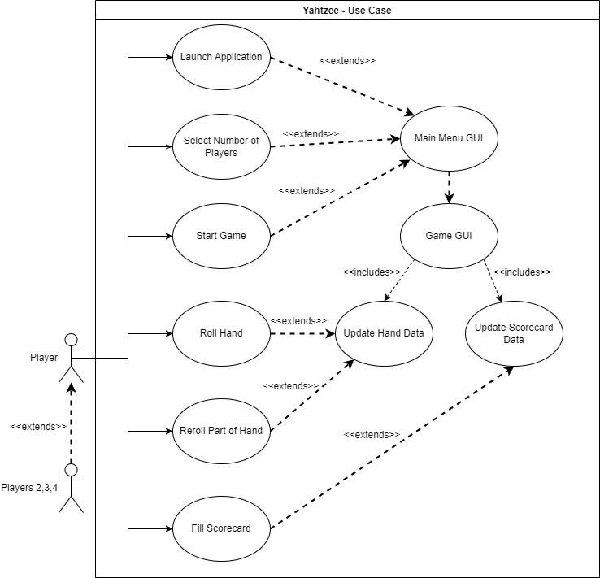
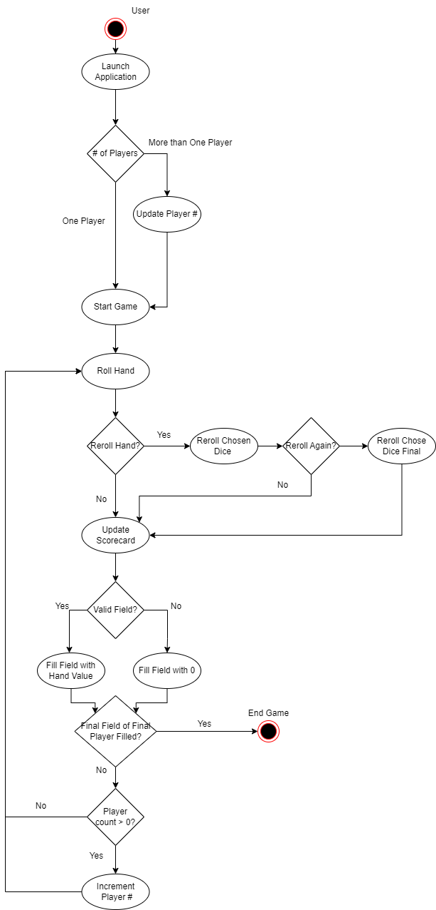
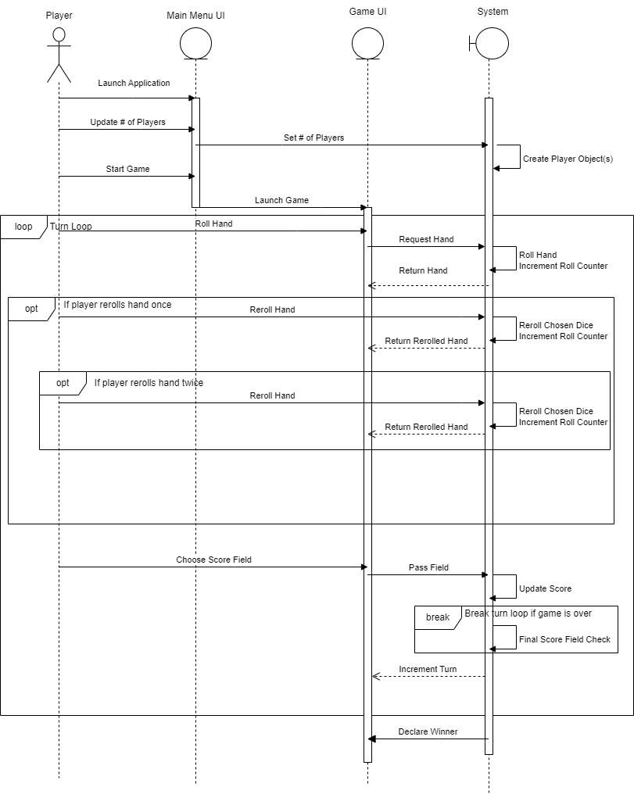
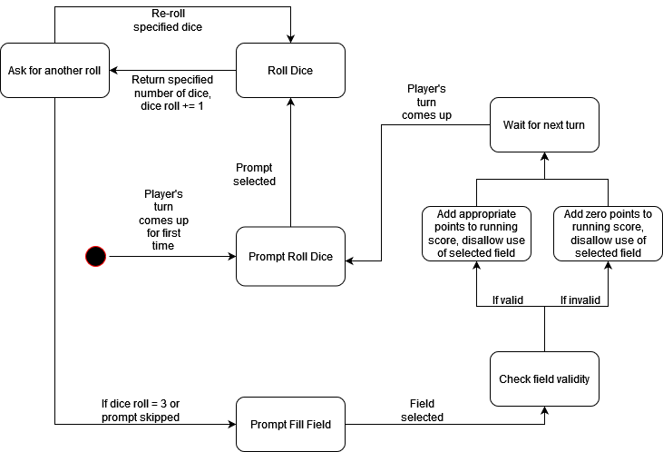

# CS 491 Project

# Software Requirements Specification
## Yahtzee Game
Prepared by Jonathon Byers and Stephen Slas
CS491
10/9/2022

Table of Contents
=================
  * [Revision History](#revision-history)
  * [Introduction](#1-introduction)
    * 1.1 [Purpose](#11-purpose)
    * 1.2 [Document Conventions](#12-document-conventions)
    * 1.3 [Intended Audience and Reading Suggestions](#13-intended-audience-and-reading-suggestions)
    * 1.4 [Product Scope](#14-product-scope)
    * 1.5 [References](#15-references)
  * [Overall Description](#overall-description)
    * 2.1 [Product Perspective](#21-product-perspective)
    * 2.2 [Product Functions](#22-product-functions)
    * 2.3 [User Classes and Characteristics](#23-user-classes-and-characteristics)
    * 2.4 [Operating Environment](#24-operating-environment)
    * 2.5 [Design and Implementation Constraints](#25-design-and-implementation-constraints)
    * 2.6 [User Documentation](#26-user-documentation)
    * 2.7 [Assumptions and Dependencies](#27-assumptions-and-dependencies)
  * [External Interface Requirements](#external-interface-requirements)
    * 3.1 [User Interfaces](#31-user-interfaces)
    * 3.2 [Hardware Interfaces](#32-hardware-interfaces)
    * 3.3 [Software Interfaces](#33-software-interfaces)
    * 3.4 [Communications Interfaces](#34-communications-interfaces)
  * [System Features](#system-features)
    * 4.1 [System Feature 1](#41-system-feature-1)
    * 4.2 [System Feature 2](#42-system-feature-2)
    * 4.3 [System Feature 3](#43-system-feature-3)
    * 4.4 [System Feature 4](#44-system-feature-4)
    * 4.5 [System Feature 5](#45-system-feature-5)
    * 4.6 [System Feature 6](#46-system-feature-6)
  * [Other Nonfunctional Requirements](#other-nonfunctional-requirements)
    * 5.1 [Performance Requirements](#51-performance-requirements)
    * 5.2 [Safety Requirements](#52-safety-requirements)
    * 5.3 [Security Requirements](#53-security-requirements)
    * 5.4 [Software Quality Attributes](#54-software-quality-attributes)
    * 5.5 [Business Rules](#55-business-rules)
  * [Other Requirements](#other-requirements)
* [Appendix A: Glossary](#appendix-a-glossary)
* [Appendix B: Analysis Models](#appendix-b-analysis-models)
* [Appendix C: To Be Determined List](#appendix-c-to-be-determined-list)

## Revision History
| Name | Date    | Reason For Changes  | Version   |
| ---- | ------- | ------------------- | --------- |
|      |         |                     |           |
|      |         |                     |           |
|      |         |                     |           |

## 1. Introduction
### 1.1 Purpose 
This is our version of the dice rolling game Yahtzee, otherwise known as Yacht Dice. This is a game that is played by rolling a hand of 5 dice in order to fill out a scorecard. The player with the highest score when all scorecards are filled out wins. This document intends to cover the full scope of the game from its backend to its user interface.

### 1.2 Document Conventions
No document conventions currently.

### 1.3 Intended Audience and Reading Suggestions
This document is intended for the professor of the class, other classmates, and any unaffiliated people that the game may be shared to. The document is structured with this introduction followed by a description of the application, individual system features, information on the interfaces, and ends with other miscellanious information.

The professor should read this document in order from overview to each following section in order to see the full scope of the document.

Other classmates should read the introduction and then decide what information is pertinent to them. If they intend to play the game they should look at the system features. If they wish to learn how it was made, they should read the description and then use the table of contents for whichever specific information they need to know.

Anyone other users should read the introduction. Another section of note would be 2.2 Product Features.
### 1.4 Product Scope
This game is intended for 1-4 players. The user should be able to pick the number of players before the game starts. When the game starts it will show the current player's scorecard and a play field for rolling the dice. The application will implement the full play loop of rolling hands and recording scores. After each turn it should pass to the next player. When each player fully fills out their scorecard, the game will tally the scorecards and determine a winner. The game will then be able to be restarted.

### 1.5 References
https://github.com/Pencilburner/CS491Project.git

## Overall Description
### 2.1 Product Perspective
This is a new, self-contained product. The SRS will cover the entirety of the system and all of its functionality. It will be made from the ground up with no sections originating from outside sources.

### 2.2 Product Functions
When the application is launched, the user will be see a main menu. On this initial menu the following functionalities are planned:
* Set Number of Players
* Rules/How to Play (optional)
* Set Names of Players (optional)
* See previous scores (optional)
* Start Game

Once the game is launched there will be a separate game interface. This interface will be split between the scorecard and the dice rolling sections. The score card should allow:
* See active players scorecard
* See active players total score
* Have a dropdown menue to switch to different players' scorecards (optional)
* Click on a field to submit current hand to that field

The dice rolling area will allow:
* Rolling a hand of 5 dice
* Choosing a number of dice to keep
* Rerolling any dice not kept 
* Repeat choosing and rerolling sequence up to one more time
* Submitting final hand

Once a player has submitted a hand into a score field, the game will repeat this process on the next player. When every player has a filled out scorecard, the game will end. The player with the highest overall score will be declared the winner. The user will then be offered to start the game again or return to the main menu.

### 2.3 User Classes and Characteristics
Currently planned classes are:
* Main Class
     This will be the main class to launch the UIs from.
* Main Menu UI Class 
     This will be the first menu the user sees and will handle user inputs on this UI
* Game UI Class
     This will be the game UI described above and will handle all actions involved in playing the game
     
Possible classes are:
* Useful functions class
    Individual methods can be placed her for better organization

### 2.4 Operating Environment
This application will be implemented on java and will be playable on any computer with java installed.
### 2.5 Design and Implementation Constraints
The two largest constraints will be time and ability. The project will have regular deadlines that we must reach throughout the semester. The final product must be complete by the end of the semester. In addition, dedicating the time requried for this project will be a challenge while keeping up with other classes and part-time jobs. Proper time management will be critical to success.

Addtionally both developers are novices with regards to software engineering and development. Many planned aspects of this project will be entirely new to us and will require much trial and error to get workable. Accounting for our own inabilities will be necessary to success.
### 2.6 User Documentation
This SRS and a README will be included.
### 2.7 Assumptions and Dependencies
No assumptions or dependencies at this time.
## External Interface Requirements
### 3.1 User Interfaces
The game will include a score card GUI with resolution able to be set at various levels but with a default of 1024x758, provided the monitor is at least that size. The game will be played with the mouse with various drop down menus. We will be using Java Swing GUI for our software.
### 3.2 Hardware Interfaces
The program will be running Java, which runs a virtual machine on the hardware, ensuring that the developers will not have to compile for different hardware or operating systems. Devices running Windows 10, Windows 11, any currently supported versions of macOS, and Ubuntu 22.04.1 will be supported.
### 3.3 Software Interfaces
This product will rely on standard Oracle Java libraries. Operating systems will utilize dependencies required for all Java applications to run this program.
### 3.4 Communications Interfaces
This program will not utilize any internet features whatsoever, being a totally offline application.
## System Features
### 4.1 System Feature 1
Graphical User Interfaces
#### 4.1.1 Description and Priority
This program will have graphical user interfaces that allow the player to interface with the game. This is a fundamental part of the concept of this project, making it a High priority.
#### 4.1.2 Stimulus/Response Sequences
Users will run the executable file of this program and the main menu GUI will be brought up. When the user has input all the options they wish to play with, they will press the "Start Game" button, causing the main menu GUI to terminate and the game menu GUI to be brought up.
#### 4.1.3 Functional Requirements
REQ-1: The game must be fully playable and customizable using only the GUI.

REQ-2: There must be at least two GUIs, one for the main menu and one for in-progress games.

REQ-3: The player must be able to view the score cards of other players during their turn, though this will be a "read-only" function.
### 4.2 System Feature 2
Roll Dice
#### 4.2.1 Description and Priority
This program will be able to roll a specified number of dice, outputting the results as integers. As this is integral to the game of Yahtzee, this feature has a High priority.
#### 4.2.2 Stimulus/Response Sequences
Players will click on the "Roll" button and roll a hand of dice. They will also be able to select "Keep" on specific dice to refrain from rolling those when pressing the "Roll" button.
#### 4.2.3 Functional Requirements
REQ-1: The dice roll function must roll a specified number of dice, up to five.

REQ-2: The dice roll function must output the results as integers.

REQ-3: The dice roll function must only be able to be accessed three times in one round.

REQ-4: The dice roll function's results must be random or pseudorandom.
### 4.3 System Feature 3
Fill Scorecard
#### 4.3.1 Description and Priority
This program will allow players to choose which field on the score card they would like to fill. Similarly to rolling dice, this feature is essential for playing Yahtzee and has a High priority.
#### 4.3.2 Stimulus/Response Sequences
After rolling one or multiple hands, players will choose a field to fill and click on a button next to that field. If this field is a valid field for the current hand, the program will calculate the correct score for the corresponding field and put that score in the box for that field. If the field chosen is not a valid field, the program will enter a zero for the score in that box.
#### 4.3.3 Functional Requirements
REQ-1: The player must be able to click a box next to a field to fill it.

REQ-2: The game must calculate whether the hand is valid for the field selected and enter the score appropriately.

REQ-3: The player must choose one field per turn in order for the turn to end and the game to progress.
### 4.4 System Feature 4
"Player" object
#### 4.4.1 Description and Priority
This program will have one or multiple "Player" objects as determined by user selection before starting the game, and name each player. Each player will have their own persistent score card. While Yahtzee is playable with one player, this project will require the ability to play with a specified number of players, making this a High priority.
#### 4.4.2 Stimulus/Response Sequences
On the main menu, the user will be able to specify how many players will be playing the game. The user will also be able to name these players. Upon starting the game, this number of player objects will be created. Each player will get a turn in order of creation until the final player has taken his turn, upon which the order of players will loop taking turns until the game ends, after which each player's score will be displayed.
#### 4.4.3 Functional Requirements
REQ-1: The specified number of players must be created at round start.

REQ-2: Players will have their own scores and score cards.

REQ-2: Individual players will have their score cards tracked persistently throughout the game.

REQ-3: Players will be sequentially modified as turns begin and end.

REQ-4: Players' scores will be displayed after the game ends.

REQ-5: Each player will be able to have a name specified for them before the beginning of the game.
### 4.5 System Feature 5
Options Menu
#### 4.5.1 Description and Priority
This program will have a menu for changing options about the game, located in the main menu. The "Number of Players" field could be located here, and the game window size could also be changed in this menu. However, this is not a strictly necessary menu to have, as this game will not have many options to change to begin with, and it may be better to have the "Number of Players" option on the main screen. For these reasons, the priority for this feature is Low priority.
#### 4.5.2 Stimulus/Response Sequences
When the main menu is pulled up, players will be able to click the "Options" button to pull up this screen and change parts of the game as they please.
#### 4.5.3 Functional Requirements
REQ-1: Players must be able to click the Options button to go to the Options screen.

REQ-2: Players must be able to change at least two aspects of the game from the Options screen, including the game window size.
### 4.6 System Feature 6
How to Play
### 4.6.1 Description and Priority
This program will have a "How to Play" button on the main menu. This button will give helpful information to players who do not know how to play Yahtzee. This feature is also not needed for this project, but we desire for our players to know how to play the game, which gives this feature Medium priority.
#### 4.6.2 Stimulus/Response Sequences
Upon starting the game and being brought to the main menu, players will click the "How to Play" button. Text will appear that tells the player how Yahtzee is played and how the program is interfaced with.
#### 4.6.3 Functional Requirements
REQ-1: The "How to Play" button must be present on the main menu GUI.

REQ-2: The "How to Play" button must present information on Yahtzee to the player after being pressed

REQ-3: The player must be able to dismiss this information and return the main menu to its original state.
## Other Nonfunctional Requirements
REQ-1: Past games should not affect future games in any way.

REQ-2: The interface should be intuitive.
### 5.1 Performance Requirements
This product has an intended target of utilizing 256 megabytes of memory or less. Our belief is that a simple program like Yahtzee should not require an enormous amount of computer resources. For this same reason we also aim to allow any modern CPU to play the game as well. Some processing power will be used to render the GUI, and some processing power will be used to perform the calculations and function calls being performed in the game's code.
### 5.2 Safety Requirements
Our team advises against playing this game for more than two hours at a time. We intend to provide no warranty for this product and furthermore absolve ourselves of all liability in the case that our product is misused, since it is a free product.
### 5.3 Security Requirements
This game will not implement any security or privacy safeguards, as it will not require any sensitive data to be input. Our team will strive to make sure the game is as bug-free as possible to reduce the possibility of a bug in our program being used to lift sensitive data from the computer by third parties.
### 5.4 Software Quality Attributes
It is important that our product is available to users, as this team of developers feels strongly about Yahtzee and the ability to play it at any moment. It is also important that our game be reliable, reusable, and usable. It must be reliable, as users will feel frustrated and not want to use the program if it is not reliable. It must be reusable, as one of the key features of Yahtzee is its replayability. It must be usable, as we want the widest userbase possible; Yahtzee is made for all ages, and it would not be ideal if players who could play Yahtzee were not able to do so because of this program's lack of usability. In addition, our software will be inherently portable as it will be written in Java.
### 5.5 Business Rules
Our goal is to create the closest possible digital analogue for Yahtzee. This includes the ability for any number of players to play a game of Yahtzee and for all the various rules of Yahtzee to be implemented and accessible through the game's GUI.

## Other Requirements
No further requirements have been proposed at this time.
### Appendix A: Glossary
No glossary terms have been created at this time.
### Appendix B: Analysis Models

### Appendix C: Project Management Plan

## 1. Overview
### 1.1 Project Purpose, Objectives, and Success Criteria
Our project aims to deliver a fully functioning Yahtzee game to users via use of Java programming, Swing GUI, and various project management tools, such as Github, Agile, and Gantt charts. We are undertaking this project so that we can get experience utilizing good software development principles and good software management techniques, so as to be good computer scientist project team members in the future. There must be a usable GUI, both a main menu GUI and a game menu GUI. There must be an option to allow n players to play the game. All players must be able to roll dice, select which dice to re-roll, fill fields properly, have their score determined accordingly, and end their turn, and proceed accordingly until the game is over and a winner can be declared according to the player with the highest score. Our stakeholder will deem the project successful if these objectives are achieved and we follow good software engineering principles as well as project management techniques. This product will not integrate with any other product, though it will be updated frequently via Git.

### 1.2 Project Deliverables
We will first submit our project management plan to Professor Glaue on February 20 via submitted files on Western Online as well as a presentation. It will consist of a COCOMO project estimation, Gantt Chart scheduling, and filled out sections of the Project Management Plan template in the SRS document.

We will then continue submitting iteratives of our project to Professor Glaue on March 19 and April 9 via submitted files on Western Online and a presentation. These will consist of our ongoing programming work on the project and demonstration of the GUI in sprint demos. They will also consist of any scheduling changes made by the group.

Finally, our completed project will be submitted to Professor Glaue via Western Online on May 1. It will contain the SRS document, a README.txt file to explain to users how to run the program, all source code, all compiled code, and all test files of the project.

### 1.3 Assumptions, Dependencies, and Constraints
Our project depends on Github and Western Online remaining online and Apache Netbeans remaining functional (SHTF). Our project also hinges on the two team members being available the last few days before a deadline, which is when most of our work gets done (LAYZ). This may sometimes prove difficult as both team members work jobs, besides being full time students, though it was not difficult last semester.

### 1.4 Evolution of the Plan
If revisions of the plan are required, the SRS document will be updated to reflect the revisions, and the revisions will be announced at the next group presentation. In addition, we will contact each other regarding the project every two weeks and attempt to identify areas of the plan that may need revision.
